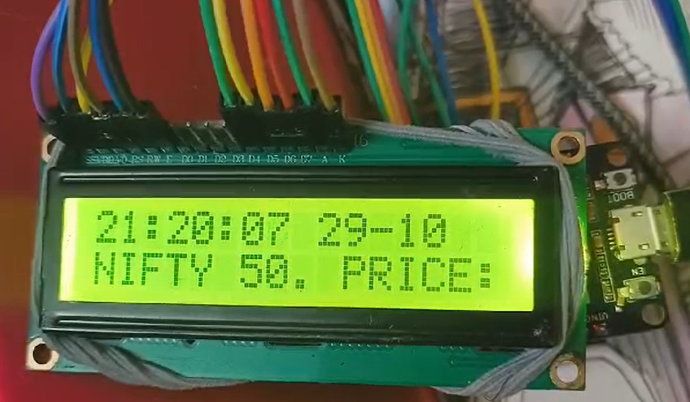

Python ESP32 LCD display 
## Step 1.  
I installed MicroPython onto ESP32 (because why not). [https://micropython.org/download/ESP32_GENERIC/](https://micropython.org/download/ESP32_GENERIC/)

## Step 2.  
I GPTed some code by feeding in the `LiquidCrystal.h` library for Arduino with some added functionality for scrolling text display. And behold > `lcd.py`.

## Step 3.  
Also, I didn't want to be recoding the ESP32 every time I needed the text updated, so I built a lambda function, so I can recode the lambda every time I want to update text instead. :).

## Step 4.  
Load the code (`boot.py` and `lcd.py`) onto the ESP32 board using [mpremote](https://docs.micropython.org/en/latest/reference/mpremote.html).

## Step 5.  
LCD work, neuron activation .

